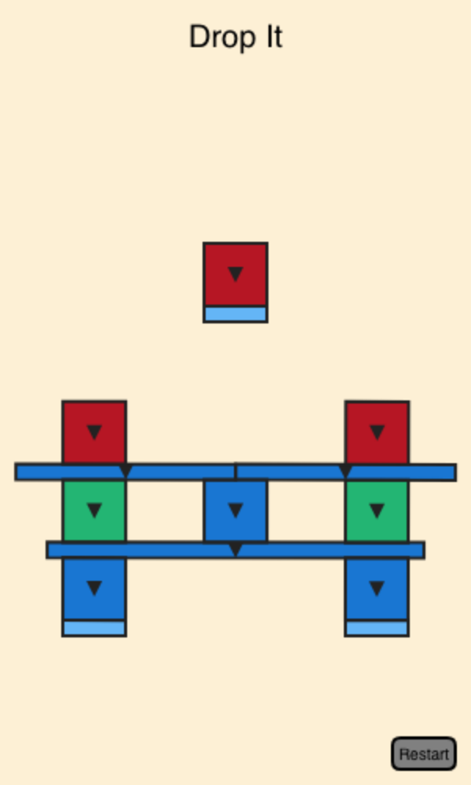

# Shape Fall

Shape Fall is a simple canvas-based physics puzzle game made with [Matter.js](https://brm.io/matter-js/). Try to beat all the levels by removing or protecting shapes while they fall in different directions.

<p style="text-align:center">
</p>

## Installation

### NPM

```bash
npm install shape-fall
```

### Script Tags

```html
<script src="https://unpkg.com/matter-js@0.20.0/build/matter.min.js"></script>
<script src="https://unpkg.com/shape-fall/dist/shape-fall.umd.min.js"></script>
```

### Embed via iframe

```html
<!-- version should be replaced with the current game version (format example: 1.0.1)-->
<iframe
  src="https://unpkg.com/shape-fall@<version>/dist/embed.html?level=0"
  style="width:300px;height:500px;border:0"
></iframe>
```

## Usage

### ESM

```js
import { initGame, loadLevel, goToLevels } from 'shape-fall';

const container = document.getElementById('app');
initGame(container);

// Optionally load a level
loadLevel(0)

// Go back to level selector
// goToLevels()
```

### Script Tags

```html
<div id="app"></div>
<script src="https://unpkg.com/matter-js@0.20.0/build/matter.min.js"></script>
<script src="https://unpkg.com/shape-fall/dist/shape-fall.umd.min.js"></script>
<script>
  ShapeFall.initGame(document.getElementById('app'));
</script>
```
